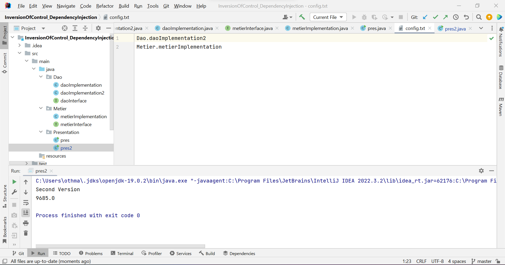

<h2>Principe de l’Inversion de Contrôle et
Injection des dépendances</h2>

<h3>L’Inversion de contrôle :</h3>

• Permettre au développeur de s’occuper uniquement du code métier (Exigences
fonctionnelles) et c’est le Framework qui s’occupe du code technique (Exigences Techniques)

<h3>L’Injection des dépendances :</h3>

• Une application doit évoluer dans le temps  
• L’application doit être fermée à la modification et ouverte à l’extension  
• Avec le <b>couplage faible</b>, nous pourrons créer des application fermée à la modification et ouvertes à
l’extension.

<h4>Le Couplage faible :</h4>

• Pour utiliser le couplage faible, nous devons utiliser les interfaces.
• Considérons une classe A qui implémente une interface IA, et une classe B qui implémente une interface IB.  
• Si la classe A est liée à l’interface IB par une association, on dit que le classe A et la classe B sont liées par un
couplage faible.  
• Cela signifie que la classe B peut fonctionner avec n’importe quelle classe qui implémente l’interface IA.  
• En effet la classe B ne connait que l’interface IA. De ce fait n’importe quelle classe implémentant cette
interface peut être associée à la classe B, sans qu’il soit nécéssaire de modifier quoi que se soit dans la
classe B.

<h3>l'interface daoInterface avec une méthode getDate</h3>

<h3>Une implémentation de cette interface (daoImplementation)</h3>

<h3>l'interface metierInterface avec une méthode calcul</h3>

<h3>Une implémentation de cette interface en utilisant le couplage faible (metierImplementation)</h3>

<h3>L’Injection des dépendances par :</h3>

<h4> 1) Instanciation Statique :</h4>

<h4> 2) Instanciation Dynamique :</h4>
<h5>config.txt est un fichier contenant les noms des classes souhaitant instancier.</h5>

<h5> A - Premier Résultat :</h5>

<h5> B - Deuxième Résultat :</h5>
<h5>Création d'une deuxième implémantation de l'interface daoInterface.</h5>

<h5>Changement du fichier config.txt</h5>

<h4> 3) Framework Spring :</h4>
<h5> A - Version XML :</h5>
<h5>applicationContext.xml est un fichier contenant les beans souhaitant instancier.</h5>

<h5> Aa - Premier Résultat :</h5>

<h5> Ab - Deuxième Résultat :</h5>

<h5> B - Version Annotations :</h5>
<h5>L'ajout d'une annotation "@Component" dans la classe metierImplementation, ainsi que l'ajout d'un constructeur à la place de "@Autowired".</h5>

